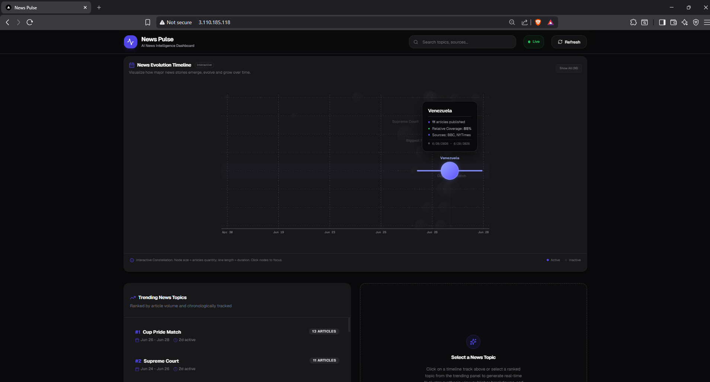
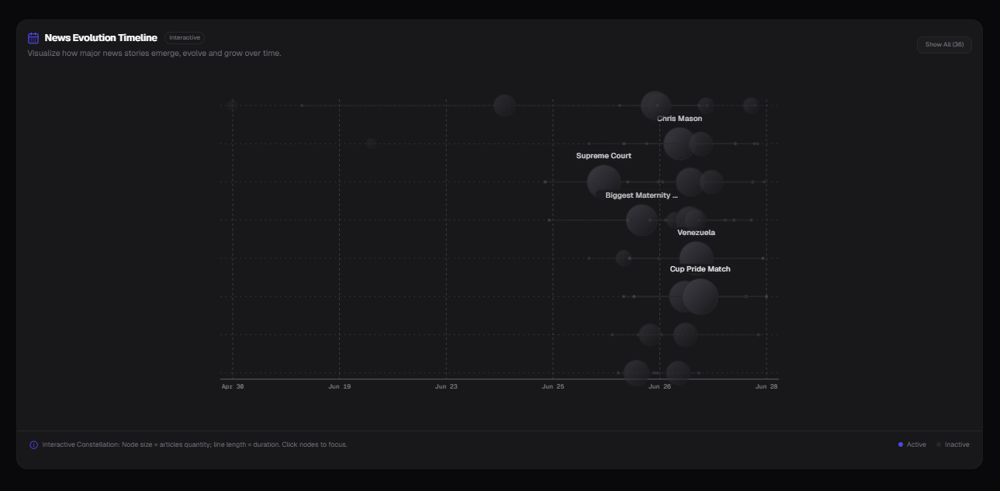
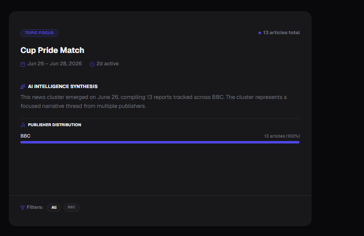
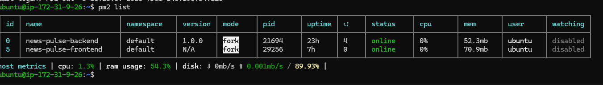
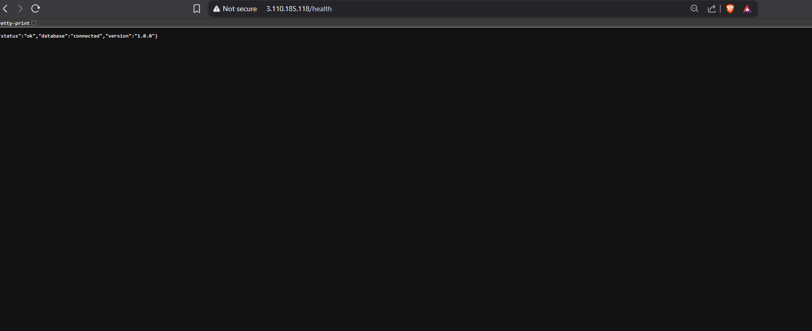

# 📰 News Pulse

> **An AI-powered News Intelligence Platform that automatically scrapes, clusters, and visualizes breaking news into evolving story timelines.**


---

## 🚀 Overview

News Pulse is a full-stack news intelligence platform that continuously collects news articles, groups related stories using clustering algorithms, and presents them as interactive timelines.

Instead of reading hundreds of individual articles, users can explore how major news stories emerge, evolve, and conclude through a clean visual dashboard.

The project was designed to demonstrate end-to-end software engineering skills—from backend API development and database design to cloud deployment on AWS.

---

## ✨ Features

- 📰 Automatic news ingestion pipeline
- 🤖 AI-powered news clustering
- 📈 Interactive timeline visualization
- 🔍 Trending topic ranking
- 📊 Cluster analytics dashboard
- ⚡ RESTful backend API
- 🗄️ PostgreSQL database hosted on AWS RDS
- ☁️ Production deployment using AWS EC2 + Nginx + PM2
- 📱 Responsive dark-themed UI built with Next.js

---

## 🛠️ Tech Stack

### Frontend
- **Next.js 16**
- **React 19**
- **TypeScript**
- **Tailwind CSS**
- **Axios**
- **Recharts**

### Backend
- **Node.js**
- **Express.js**
- **Python** (News scraping pipeline)

### Database
- **PostgreSQL**
- **AWS RDS**

### Cloud & DevOps
- **AWS EC2**
- **Nginx**
- **PM2**
- **Git & GitHub**

### Development Tools
- VS Code
- Postman
- pgAdmin

---

## 📂 Project Structure

```text
News-Pulse/
│
├── backend/          # Express REST API
├── frontend/         # Next.js frontend
├── scraper/          # Python scraping pipeline
├── .github/          # GitHub workflows
├── README.md
├── roadmap.md
├── News_Pulse_PRD.md
└── News_Pulse_TRD.md
```

## 🏗️ System Architecture

```text
                    User
                      │
                      ▼
                Nginx (Port 80)
                      │
        ┌─────────────┴─────────────┐
        ▼                           ▼
 Next.js Frontend            Express Backend
    (Port 3000)               (Port 4000)
                                      │
                                      ▼
                            PostgreSQL (AWS RDS)
                                      │
                                      ▼
                           Python News Scraper
```
```

---

## Setup Instructions

### Prerequisites
* Node.js (v20+)
* npm or yarn
* Python (3.11+)
* PostgreSQL instance

### 1. Database Setup
1. Create a PostgreSQL database.
2. In the `backend` directory, create a `.env` file from `.env.example` and set `DATABASE_URL`.
3. Run the initialization script to create tables:
   ```bash
   cd backend
   npm run db:init
   ```

## 📸 Screenshots

### Dashboard



### Timeline



### Cluster Details



### AWS Deployment


### PM2



### API Health



---
### 2. Backend Setup
1. Install dependencies:
   ```bash
   cd backend
   npm install
   ```
2. Start in development:
   ```bash
   npm run dev
   ```

### 3. Scraper Setup
1. Create a Python virtual environment:
   ```bash
   cd scraper
   python -m venv .venv
   ```
2. Activate the virtual environment:
   - Windows: `.venv\Scripts\activate`
   - macOS/Linux: `source .venv/bin/activate`
3. Install dependencies:
   ```bash
   pip install -r requirements.txt
   ```

### 4. Frontend Setup
1. Install dependencies:
   ```bash
   cd frontend
   npm install
   ```
2. Start in development:
   ```bash
   npm run dev
   ```

---

## Running the Components

### Backend
Start the Express server on configured `PORT` (defaults to 4000):
```bash
cd backend
npm run dev
```

### Python Scraper
Run scraper from CLI manually:
* Full run:
  ```bash
  cd scraper
  python main.py --mode=full
  ```
* Incremental run:
  ```bash
  cd scraper
  python main.py --mode=incremental
  ```

### Frontend
Start Next.js dev server:
```bash
cd frontend
npm run dev
```
Open [http://localhost:3000](http://localhost:3000) to view the timeline.
