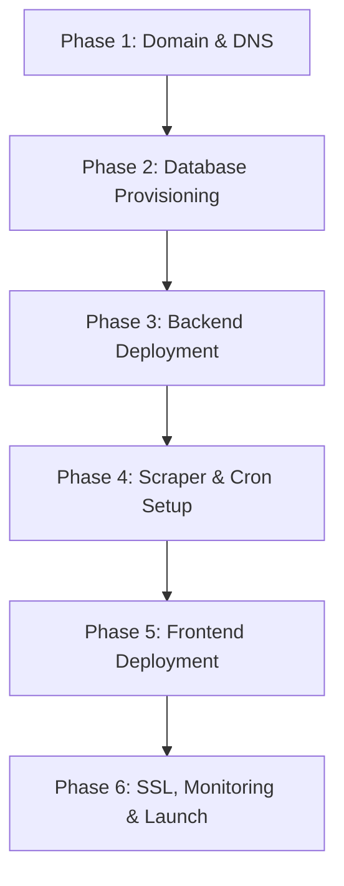

# 🗺️ News Pulse Production Deployment Roadmap

This document outlines the step-by-step roadmap for deploying the **News Pulse** intelligence platform (Next.js frontend, Node.js/Express backend, PostgreSQL database, and Python AI scraper) to a production-ready environment.

---

## 📅 Roadmap Overview



---

## 🛠️ Step-by-Step Deployment Guide

### Phase 1: Domain Registration & DNS Setup
1. **Purchase Domain Name**: 
   * Acquire a domain (e.g., `newspulse.live`, `newspulse.app`, or `newspulse.co`) through a registrar like Namecheap, Cloudflare, or GoDaddy.
2. **DNS Hosting & CDN Integration (Recommended: Cloudflare)**:
   * Point the domain's nameservers to Cloudflare for advanced DDoS protection, SSL management, and faster global DNS resolution.
3. **Plan DNS Record Allocation**:
   * Root/Apex domain: `newspulse.live` $\rightarrow$ Points to the Frontend (e.g., Vercel / Netlify).
   * Subdomain: `api.newspulse.live` $\rightarrow$ Points to the Backend API server (e.g., Render / AWS / DigitalOcean).

---

### Phase 2: Database Provisioning
1. **Choose managed PostgreSQL Host**:
   * **Serverless Option (Recommended)**: [Neon](https://neon.tech) or [Supabase](https://supabase.com) (provides automatic scaling, instant backups, and connection pooling).
   * **VPS Option**: Local PostgreSQL server installed on a Ubuntu VPS (e.g., DigitalOcean Droplet, AWS EC2).
2. **Configure Database Access**:
   * Obtain the connection string (`postgresql://<user>:<password>@<host>/<dbname>?sslmode=require`).
   * Create target database tables using the schema scripts in the backend repository.
   * Enable connection pooling (e.g., `PgBouncer` or Neon's built-in pooler) to handle scaling scraper database connections.

---

### Phase 3: Backend API Deployment
1. **Hosting Platform Selection**:
   * **PaaS (Recommended)**: [Render](https://render.com) or [Railway](https://railway.app) (easy git-push-to-deploy, managed runtime).
   * **VPS (Custom)**: Ubuntu server + `PM2` process manager + `Nginx` reverse proxy.
2. **Configure Environment Variables**:
   * Create the environment settings on your host:
     ```env
     PORT=4000
     NODE_ENV=production
     DATABASE_URL=postgresql://... (Use pooler URL)
     ```
3. **Process Management (If using VPS)**:
   * Install and configure `PM2` to manage the Node.js API server process:
     ```bash
     npm install -g pm2
     pm2 start src/index.js --name "newspulse-api"
     pm2 save
     pm2 startup
     ```
4. **Nginx Reverse Proxy & SSL (If using VPS)**:
   * Route incoming traffic from port `80`/`443` to local port `4000`.
   * Secure with Let's Encrypt / Certbot:
     ```bash
     sudo apt install certbot python3-certbot-nginx
     sudo certbot --nginx -d api.newspulse.live
     ```

---

### Phase 4: Scraper & Automation Setup
1. **Execution Host**:
   * The Python scraper can run on the same VPS hosting the backend API, or via automated cloud triggers.
2. **Python Environment Setup**:
   * Install dependencies on the execution host:
     ```bash
     pip install -r scraper/requirements.txt
     ```
3. **Configure Scraper Credentials**:
   * Set up `.env` on the host:
     ```env
     DATABASE_URL=postgresql://... (Direct DB URL, bypassing pooler)
     ```
4. **Cron Job Schedule Setup**:
   * Open crontab config (`crontab -e`) to automate ingestion and deduplication cycles.
   * **Example Ingestion Schedule (Every 30 minutes)**:
     ```cron
     */30 * * * * cd /path/to/project && /usr/bin/python3 scraper/ingest.py >> /var/log/newspulse/ingest.log 2>&1
     ```
   * **Example Clustering/Deduplication Schedule (Every hour)**:
     ```cron
     0 * * * * cd /path/to/project && /usr/bin/python3 scraper/cluster.py >> /var/log/newspulse/cluster.log 2>&1
     ```

---

### Phase 5: Frontend Deployment
1. **Hosting Platform Selection**:
   * **Recommended**: [Vercel](https://vercel.com) (native Next.js integration, instant CDN caching, edge rendering support).
   * **Alternative**: [Netlify](https://netlify.com) or custom VPS hosting (Next.js server running under PM2 + Nginx reverse proxy).
2. **Configure Build Settings**:
   * Set environment variables in the dashboard:
     ```env
     NEXT_PUBLIC_API_BASE_URL=https://api.newspulse.live
     ```
3. **Trigger Production Build**:
   * Deploy the `frontend/` directory. Vercel automatically runs the optimized production compilation:
     ```bash
     npm run build
     ```
4. **Assign Custom Domain**:
   * Link `newspulse.live` in Vercel. Configure the DNS CNAME/A records pointing to `cname.vercel-dns.com` in Cloudflare/your registrar.

---

### Phase 6: SSL, Monitoring & Launch
1. **SSL Handshake Verification**:
   * Ensure `https://newspulse.live` and `https://api.newspulse.live` are resolving securely over HTTPS with valid Let's Encrypt or Cloudflare TLS certificates.
2. **Health Check & Verification**:
   * Confirm frontend communicates successfully with the production API.
   * Check for CORS errors (CORS must allow `https://newspulse.live` on the Node.js Express backend).
3. **Error & Log Monitoring**:
   * Monitor API server logs using `pm2 logs` or PaaS log streaming.
   * Watch python scraper output logs to ensure regular ingestion updates occur correctly.
